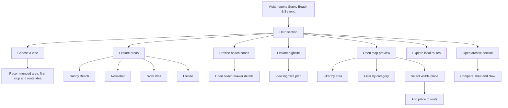

# 🌊 Sunny Beach & Beyond — Interactive Coastal Travel Guide

<p>
  <a href="#live-demo">
    
  </a>
</p>

[](https://vitejs.dev/)
[](https://react.dev/)
[](https://www.typescriptlang.org/)
[](https://tailwindcss.com/)
[](https://lucide.dev/)
[](#project-status)
[](#technical-scope)

**Sunny Beach & Beyond** is a modern interactive coastal travel guide for **Sunny Beach, Nessebar, Sveti Vlas and Elenite** on Bulgaria’s southern Black Sea coast.

The project combines a cinematic hero section, real coastline imagery, beach guidance, nightlife notes, local observations, practical routes, a map-style place explorer and an archive-inspired **Then & Now** section.

It is designed to feel like a premium seaside travel magazine, personal field guide and curated local archive — not a generic tourism template or booking website.

---

## 🌐 Live Demo

| Platform | URL         |
| -------- | ----------- |
| Web App  | Coming soon |

---

## ✨ Highlights

* 🌊 **Cinematic coastal hero** using a real Sunny Beach coastline image.
* 🧭 **Interactive single-page travel guide** for Sunny Beach, Nessebar, Sveti Vlas and Elenite.
* 🏖️ **Beach zone explorer** with practical notes for different types of beach days.
* 🌙 **Nightlife guide** covering beach bars, clubs, pool parties, cocktail bars and late-night food.
* 🗺️ **Map-style place explorer** with area and category filters.
* 📍 **Selectable route stops** for building lightweight coastal route ideas.
* 🧠 **Mood-based “Vibes” section** that suggests areas, routes and beach options.
* 🏘️ **Area guide** with practical local notes for each coastal zone.
* 🕰️ **Archive-inspired Then & Now section** showing how the coastline has changed over time.
* 🎨 **Editorial visual direction** with glass UI, soft motion, hover states and premium travel-magazine styling.
* ⚡ **Frontend-only architecture** using local TypeScript data files.
* 📱 **Responsive layout** designed for modern portfolio presentation.

---

## 📋 Project Description

**Sunny Beach & Beyond** is a portfolio front-end project focused on presenting the Bulgarian southern Black Sea coast through an editorial and interactive experience.

The guide is built around a simple idea: Sunny Beach is not one place. The area changes dramatically depending on where you stay, when you move, which beach zone you choose and whether you are looking for nightlife, history, calm evenings or practical family routes.

The project uses structured local data to present the coast as a curated experience instead of a static landing page.

It includes interactive UI sections, hover-driven details, active states, filters, selected route stops and visual storytelling elements.

---

## 🧭 Application Flow



---

## 🖥️ Implemented Sections

* Hero introduction
* Vibes / mood selector
* Area guide
* Beach zones
* Nightlife guide
* Local field notes
* Interactive map preview
* Local routes
* Archive / Then & Now
* Footer

---

## 🗺️ Interactive Map Preview

The map preview is a custom UI concept rather than a real map provider integration.

It includes:

* area filters
* category filters
* dynamic matching places count
* visible map pins
* selected place details
* empty-state handling when no places match
* route stop selection
* Google Maps action placeholder
* lightweight route-building behavior

The goal is to demonstrate interactive front-end logic, UI state management and polished product behavior without requiring a backend or third-party map API.

---

## 🏖️ Coastal Areas

The guide currently focuses on four connected areas:

| Area        | Role in the guide                                                   |
| ----------- | ------------------------------------------------------------------- |
| Sunny Beach | Main resort strip, beaches, nightlife and practical first-time base |
| Nessebar    | Historic old town, sea edges, walking routes and cultural contrast  |
| Sveti Vlas  | Marina views, calmer evenings and more polished coastal atmosphere  |
| Elenite     | Quieter northern edge, slower beach time and planned resort stays   |

---

## 🧱 Tech Stack

* Vite
* React
* TypeScript
* Tailwind CSS
* lucide-react
* Local TypeScript data files

---

## 📁 Project Structure

```bash
sunny-beach-beyond/
├── public/
├── src/
│   ├── assets/
│   │   └── sunny-beach-hero.png
│   ├── components/
│   │   ├── layout/
│   │   ├── sections/
│   │   └── ui/
│   ├── data/
│   │   ├── archive.ts
│   │   ├── areas.ts
│   │   ├── places.ts
│   │   └── index.ts
│   ├── types/
│   ├── App.tsx
│   ├── index.css
│   └── main.tsx
├── package.json
├── vite.config.ts
└── README.md
```

---

## 🚀 Local Development

Install dependencies:

```bash
npm install
```

Run the development server:

```bash
npm run dev
```

Build for production:

```bash
npm run build
```

Preview the production build:

```bash
npm run preview
```

---

## ✅ Build

The project builds with:

```bash
npm run build
```

---

## 📌 Project Status

**Status:** Portfolio MVP in active polish phase.

The project is functional and builds successfully, but the goal is not only to have a working app. The current focus is to push the UI closer to a premium, professional-grade travel/editorial product.

Current polish priorities:

* stronger interaction between sections
* better hover and active states
* more meaningful map behavior
* improved real-image integration
* stronger section rhythm and spacing
* richer route and archive interactions
* more professional responsive behavior

---

## 🎯 Technical Scope

This project is intentionally frontend-only.

It does **not** include:

* backend
* database
* authentication
* admin panel
* booking system
* payment system
* hotel inventory
* restaurant management
* real map API integration

The purpose is to demonstrate front-end architecture, UI polish, state-driven interaction and editorial product design.

---

## ❌ What This Project Is Not

Sunny Beach & Beyond is not:

* a hotel booking website
* a restaurant directory
* a real estate portal
* a tourism agency website
* an admin dashboard
* a recipe or food app
* a payment or reservation platform

It is a curated digital travel guide and portfolio front-end project.

---

## 🧩 Future Improvements

Planned improvements include:

* real deployment
* stronger mobile polish
* more real coastline photography
* improved map route behavior
* richer place detail panels
* smoother section transitions
* more local notes and practical tips
* stronger archive storytelling
* optional integration with real map links

---

## 👤 Author

Built by **Stefan Badev** as a front-end portfolio project focused on React, TypeScript, interactive UI, editorial design and practical travel-guide presentation.
